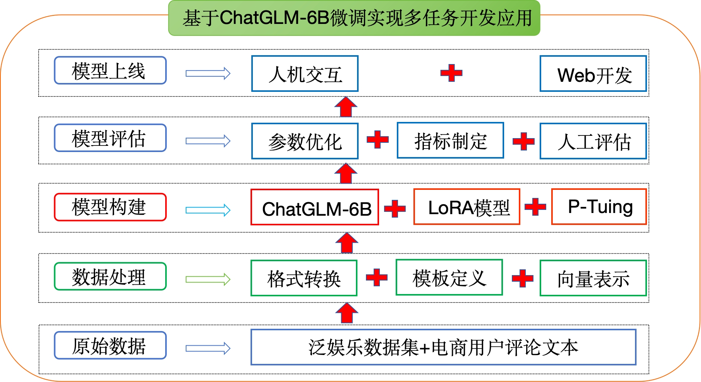
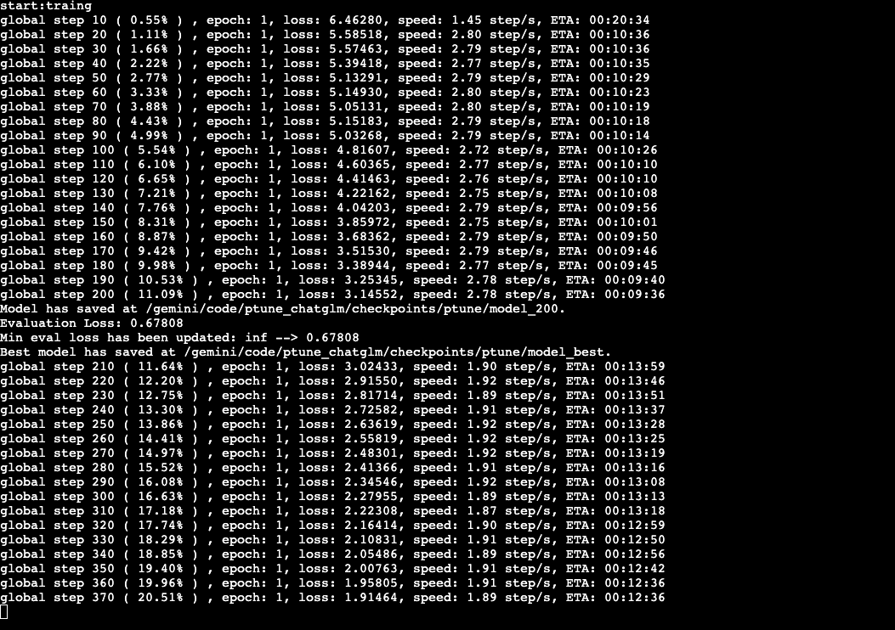
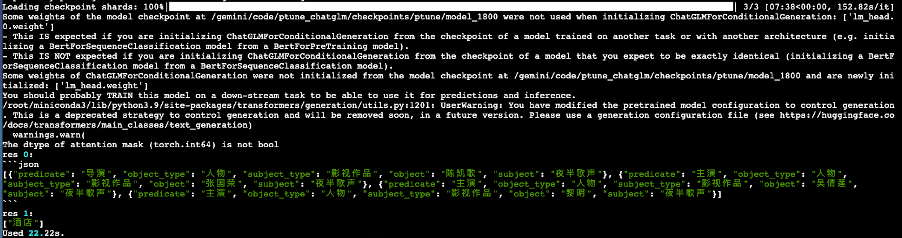

# 基于ChatGLM微调多任务实战

## 1. 项目介绍【理解】

------

### 1.1. 项目简介

LLM（Large Language Model）通常拥有大量的先验知识，使得其在许多自然语言处理任务上都有着不错的性能。但，想要直接利用 LLM 完成一些任务会存在一些答案解析上的困难，如规范化输出格式，严格服从输入信息等。因此，在这个项目中我们对大模型 [ChatGLM-6B](https://github.com/THUDM/ChatGLM-6B) 进行 Finetune，使其能够更好的对齐我们所需要的输出格式。

### 1.2. ChatGLM-6B模型

#### 1.2.1 模型介绍

ChatGLM-6B 是清华大学提出的一个开源、支持中英双语的对话语言模型，基于 General Language Model (GLM) 架构，具有 62 亿参数。该模型使用了和 ChatGPT 相似的技术，经过约 1T 标识符的中英双语训练(中英文比例为 1:1)，辅以监督微调、反馈自助、人类反馈强化学习等技术的加持，62 亿参数的 ChatGLM-6B 已经能生成相当符合人类偏好的回答（目前中文支持最好）。

相比原始Decoder模块，ChatGLM-6B模型结构有如下改动点：

- **embedding 层梯度缩减**：为了提升训练稳定性，减小了 embedding 层的梯度。梯度缩减的效果相当于把 embedding 层的梯度缩小了 10 倍，减小了梯度的范数。
- **layer normalization**：采用了基于 Deep Norm 的 post layer norm。
- **激活函数**：替换ReLU激活函数采用了 GeGLU 激活函数。
- **位置编码**：去除了绝对位置编码，采用了旋转位置编码 RoPE。

#### 1.2.2 模型配置(6B)

|    配置    |  数据  |
| :--------: | :----: |
|    参数    |  6.2B  |
| 隐藏层维度 |  4096  |
|    层数    |   28   |
| 注意力头数 |   32   |
|  训练数据  |   1T   |
|  词表大小  | 130528 |
|  最大长度  |  2048  |

------

#### 1.2.3 硬件要求(官网介绍)

|   量化等级   | 最低GPU显存（推理） | 最低GPU显存（高效参数微调） |
| :----------: | :-----------------: | :-------------------------: |
| FP16(无量化) |        13GB         |            14GB             |
|     INT8     |        10GB         |             9GB             |
|     INT4     |         6GB         |             7GB             |

------

> 注意：显存的占用除了跟模型参数大小有关系外，还和文本支持最大长度有关

#### 1.2.4 模型特点

- 优点
    - 1.较低的部署门槛： INT4 精度下，只需6GB显存，使得 ChatGLM-6B 可以部署在消费级显卡上进行推理。
    - 2.更长的序列长度： 相比 GLM-10B（序列长度1024），ChatGLM2-6B 序列长度达32K，支持更长对话和应用。
    - 人类类意图对齐训练
- 缺点：
    - 模型容量小，相对较弱的模型记忆和语言能力。
    - 较弱的多轮对话能力。

### 1.3. 环境配置

#### 1.3.1 基础环境配置：

本次环境依赖于AutoDL算力：https://www.autodl.com/home

- 操作系统: ubuntu22.04
- CPUs: 14 core(s)，内存：100G
- GPUs: 1卡， A800， 80GB GPUs
- Python: 3.10
- Pytorh: 2.5.1
- Cuda: 12.4
- 价格：5.98元/小时

#### 1.3.2 安装依赖包：

1. 创建一个虚拟环境，您可以把 `llm_env` 修改为任意你想要新建的环境名称：

```sh
conda create -n llm_env python=3.10
```

2. 激活新建虚拟环境

```shell
conda activate llm_env
```

注意： **如果激活失败，则先运行 conda init，然后退出终端，重新打开一个终端。** 

3. 安装相应的依赖包：

```sh
-- 成功切换到llm_env后安装
pip install -r requirements.txt
```

> ```python
> protobuf>=3.19.5,<3.20.1
> transformers==4.33
> icetk
> cpm_kernels
> streamlit==1.18.0
> matplotlib
> datasets
> accelerate>=0.20.3
> packaging>=20.0
> psutil
> pyyaml
> peft==0.3.0
> ```
>
> requirements.txt文件内容如上所示

------

#### 1.3.3 预训练模型下载：

- 创建目录

```shell
mkdir -p /root/autodl-tmp/llm_tuning/THUDM/chatglm-6b
cd /root/autodl-tmp/llm_tuning/THUDM/chatglm-6b
```

- 安装modelscope

```shell
pip install modelscope
```

- 下载chatglm-6b

```shell
modelscope download --model ZhipuAI/ChatGLM-6B --local_dir ./
```

- python文件下载

如果configuration_chatglm.py、modeling_chatglm.py、quantization.py、tokenization_chatglm.py文件没有下载成功，则手动下载，然后添加到chatglm-6b的文件夹中。

下载位置：https://modelscope.cn/models/ZhipuAI/ChatGLM-6B/files


### 1.4. 项目架构

项目架构流程图：

<div align=center></div>

项目代码架构图：


## 2.数据预处理【掌握】

- 本项目中对数据部分的预处理步骤如下:
    1. 查看项目数据集
    2. 编写Config类项目文件配置代码
    3. 编写数据处理相关代码

### 2.1 查看项目数据集

- 数据存放位置：llm_tuning/ptune_chatglm/data

- data文件夹里面包含3个jsonl文档，分别为：mixed_train_dataset.jsonl、mixed_dev_dataset.jsonl、dataset.jsonl

------

#### 2.1.1 train.jsonl

- mixed_train_dataset.jsonl为训练数据集，因为我们本次项目同时进行「信息抽取+文本分类」两项任务，因此数据中混合了两种任务数据类型。举例展示如下：

    - 信息抽取数据示例
    - Instruction 部分告诉模型现在需要做「阅读理解」任务，Input 部分告知模型要抽取的句子以及输出的格式。

    ```json
    {
        "context": "Instruction: 你现在是一个很厉害的阅读理解器，严格按照人类指令进行回答。\nInput: 找到句子中的三元组信息并输出成json给我:\n\n九玄珠是在纵横中文网连载的一部小说，作者是龙马。\nAnswer: ", 
        "target": "```json\n[{\"predicate\": \"连载网站\", \"object_type\": \"网站\", \"subject_type\": \"网络小说\", \"object\": \"纵横中文网\", \"subject\": \"九玄珠\"}, {\"predicate\": \"作者\", \"object_type\": \"人物\", \"subject_type\": \"图书作品\", \"object\": \"龙马\", \"subject\": \"九玄珠\"}]\n```"
    }
    ```

    - 文本数据示例
    - Instruction 部分告诉模型现在需要做「阅读理解」任务，Input 部分告知模型要抽取的句子以及输出的格式。

    ```json
    {
        "context": "Instruction: 你现在是一个很厉害的阅读理解器，严格按照人类指令进行回答。\nInput: 下面句子可能是一条关于什么的评论，用列表形式回答：\n\n很不错，很新鲜，快递小哥服务很好，水果也挺甜挺脆的\nAnswer: ", 
        "target": "[\"水果\"]"
    }
    ```

> 训练集中一共包含902条数据，每一条数据都分为 `context` 和 `target` 两部分：
>
> 1. `context` 部分是接受用户的输入。2.` target` 部分用于指定模型的输出。
>
> 在 `context` 中又包括 2 个部分：
>
> 1. Instruction：用于告知模型的具体指令，当需要一个模型同时解决多个任务时可以设定不同的 Instruction 来帮助模型判别当前应当做什么任务。
> 2. Input：当前用户的输入。

------

#### 2.1.2 dev.jsonl

- mixed_dev_dataset.jsonl为验证数据集，数据格式同train.jsonl。

------

如果想使用自定义数据训练，只需要仿照上述示例数据构建数据集即可。

### 2.2 编写项目Config类配置文件

- 代码路径：llm_tuning/ptune_chatglm/glm_config.py

- config文件目的：配置项目常用变量，一般这些变量属于不经常改变的，比如：训练文件路径、模型训练次数、模型超参数等等

具体代码实现：

```python
import os.path

import torch

base_dir = os.path.dirname(os.path.abspath(__file__))
# print(f'base_dir-->{base_dir}')

class ProjectConfig(object):
    def __init__(self):
        # 定义是否使用GPU
        self.device = 'cuda:0' if torch.cuda.is_available() else 'cpu'
        # self.device = 'mps:0' if torch.cuda.is_available() else 'cpu'
        # 定义ChatGLM-6B模型的路径
        self.pre_model = os.path.join(base_dir, '../THUDM/model/chatglm-6b-int4')
        # 定义训练数据的路径
        self.train_path = os.path.join(base_dir, 'data/mixed_train_dataset.jsonl')
        # 定义验证集的路径
        self.dev_path = os.path.join(base_dir, 'data/mixed_dev_dataset.jsonl')
        # 是否使用LoRA方法微调
        self.use_lora = True
        # 是否使用P-Tuing方法微调
        self.use_ptuning = False
        # 秩==8
        self.lora_rank = 8
        # 一个批次多少样本
        self.batch_size = 4
        # 训练几轮
        self.epochs = 2
        # 学习率
        self.learning_rate = 3e-5
        # 权重权重系数
        self.weight_decay = 0
        # 学习率预热比例
        self.warmup_ratio = 0.06
        # context文本的输入长度限制
        self.max_source_seq_len = 100
        # target文本长度限制
        self.max_target_seq_len = 100
        # 每隔多少步打印日志
        self.logging_steps = 10
        # 每隔多少步保存
        self.save_freq = 200
        # 如果你使用了P-Tuing，要定义伪tokens的长度
        self.pre_seq_len = 200
        self.prefix_projection = False  # 默认为False,即p-tuning,如果为True，即p-tuning-v2
        # 保存模型的路径
        self.save_dir = os.path.join(base_dir, 'save_model')


if __name__ == '__main__':
    pc = ProjectConfig()
    print(pc.save_dir)
```

### 2.3 编写数据处理相关代码

- 代码路径：llm_tuning/ptune_chatglm/data_handle
- data_handle文件夹中一共包含两个py脚本：data_preprocess.py、data_loader.py

#### 2.3.1 data_preprocess.py

- 模型输入和标签的构建思路：


- 目的: 将样本数据转换为模型接受的输入数据
    - 定义数据转换方法convert_example()
    - 定义获取训练或验证数据最大长度方法get_max_length()


代码如下：

```python
import sys
import os
project_root = os.path.join(os.path.dirname(os.path.abspath(__file__)), '../..')
# print(f'project_root-->{project_root}')
sys.path.append(project_root)

import json
# 返回的字符串包含有关异常的详细信
import numpy as np
from tqdm import tqdm
from transformers import AutoTokenizer

from ptune_chatglm.glm_config import ProjectConfig

pc = ProjectConfig()

def convert_example_chatglm(
        examples: dict,
        tokenizer,
        max_source_seq_len: int,
        max_target_seq_len: int,
):
    '''
    将样本数据转换为Prompt-tuning模型接收的输入数据。
    :param examples: (dict): 训练数据样本,
    e.g. -> {
            "text": [
                        '{"context": "年基准利率4.35%。从实际看...", "target": "2017年银行贷款基准利率"}',
                        ...
            ]
        }
    :param tokenizer: 分词器
    :param max_source_seq_len: (int): prompt最大长度
    :param max_target_seq_len: (int): 答案最大长度
    :return:
    dict (str: np.array) ->
    tokenized_output = {
        'input_ids': [[1525, 10, ...], [758, 2345, ...]],
        'labels': [[822, 10, ...], [125, 58...]]
    }
    '''
    # 初始化一个字典，用于存储编码后的输入ID和对应的标签
    tokenized_output = {
        'input_ids': [],  # 存储编码后的输入ID列表
        'labels': []  # 存储对应的标签列表
    }
    # 设定句子的最大长度
    max_seq_len = max_source_seq_len + max_target_seq_len

    # 遍历每个样本
    for example in tqdm(examples['text']):
        # print(f'example--> {example}')
        # print(f'type(example)--> {type(example)}')
        try:
            # 1.将字符串转成字典，取出问题和答案
            example = json.loads(example)
            # print(f'example-->{example}')
            context = example["context"]
            target = example["target"]
            # print(f'context-->\n{context}')
            # print(f'context2len-->{len(context)}')
            # print(f'target-->\n{target}')

            # 2.将问题和答案进行分词转成id
            context_ids = tokenizer.encode(context, add_special_tokens=False)  # 不需要添加特殊标记，原因是需要手动添加
            # print(f'context_ids--->{context_ids}')
            target_ids = tokenizer.encode(target, add_special_tokens=False)
            # print(f'target_ids--->{target_ids}')

            # 3.将问题和答案超过最大长度的进行截断
            # 如果问题长度超过 max_source_seq_len - 1，则截断，因为需要留出一个位置给[gMASK]
            if len(context_ids) > max_source_seq_len - 1:
                context_ids = context_ids[:max_source_seq_len - 1]
            # 如果答案长度超过 max_target_seq_len - 2 ，则截断，因为需要留两个位置给[sop]和[eop]
            if len(target_ids) > max_target_seq_len - 2:
                target_ids = target_ids[:max_target_seq_len - 2]
            # print(f'context_ids--->{context_ids}')
            # print(f'target_ids--->{target_ids}')

            # 4.将问题和答案拼接起来作为input_ids
            # source_ids + [gMASK] + <sop>[也是bos] + target_ids + <eop>
            input_ids = tokenizer.build_inputs_with_special_tokens(context_ids, target_ids)
            # print(f'input_ids--->{input_ids}')

            # 5.将问题作为labels，需要将问题所在的位置设置为-100, 因为-100表示忽略，不计算损失
            # 查找bos_token_id的索引位置，这个索引位置就是问题结束的位置，也是问题的长度
            context_length = input_ids.index(tokenizer.bos_token_id)
            # 将问题所在位置的id设置为-100，另外，答案所在的位置进行保留原id
            labels = [-100] * context_length + input_ids[context_length:]
            # print(f'labels--->{labels}')

            # 6.需要将短的句子进行补齐，填充到max_seq_len
            pad_len = max_seq_len - len(input_ids)
            # input_ids需要使用pad_token_id进行填充
            input_ids += [tokenizer.pad_token_id] * pad_len
            # print(f'input_ids--->{input_ids}')
            # labels需要使用-100进行填充
            labels += [-100] * pad_len
            # print(f'labels--->{labels}')

            # 7.将处理好的input_ids和labels添加到tokenized_output中
            tokenized_output['input_ids'].append(input_ids)
            tokenized_output['labels'].append(labels)
        except Exception as e:
            print(f'Exception-->{e}')
            continue

    # 将输出中的每个值转换成numpy数组
    for k, v in tokenized_output.items():
            tokenized_output[k] = np.array(v)

    return tokenized_output

def get_max_length(
        tokenizer,
        dataset_file: str
):
    '''
    测试数据集最大的输入/输出tokens是多少。
    :param tokenizer: 分词器
    :param dataset_file: (str): _description_
    :return:
    '''
    # 初始化源序列长度列表和目标序列长度列表
    source_seq_len_list = []
    target_seq_len_list = []

    # 打开数据集文件以读取数据
    with open(dataset_file, 'r', encoding='utf-8') as f:
        # 使用tqdm包装读取操作，以便显示进度条
        for line in tqdm(f.readlines()):
            # 将每一行转换为JSON对象
            line = json.loads(line)

            # 对源文本进行编码，并计算其序列长度
            source_len = tokenizer.encode(line['context'])
            source_seq_len_list.append(len(source_len))

            # 对目标文本进行编码，并计算其序列长度
            target_len = tokenizer.encode(line['target'])
            target_seq_len_list.append(len(target_len))
            
    print(f"【Source Sequence】 Max: {max(source_seq_len_list)}, "
          f"Avg: {int(sum(source_seq_len_list) / len(source_seq_len_list))}, "
          f"Middle: {sorted(source_seq_len_list)[int(len(source_seq_len_list) / 2)]}.")
    print(f"【Target Sequence】 Max: {max(target_seq_len_list)}, "
          f"Avg: {int(sum(target_seq_len_list) / len(target_seq_len_list))}, "
          f"Middle: {sorted(target_seq_len_list)[int(len(target_seq_len_list) / 2)]}.")


if __name__ == '__main__':
    examples = {'text': [
        '{"context": "Instruction: 你现在是一个很厉害的阅读理解器，严格按照人类指令进行回答。\\nInput: 句子中包含了哪些信息，输出json：\\n\\n如何演好自己的角色，请读《演员自我修养>《喜剧之王>周星驰崛起于穷困潦倒之中的独门秘笈。\\nAnswer: ", "target": "```json\\n[{\\"predicate\\": \\"主演\\", \\"object_type\\": \\"人物\\", \\"subject_type\\": \\"影视作品\\", \\"object\\": \\"周星驰\\", \\"subject\\": \\"喜剧之王\\"}]\\n```"}'
    ]}
    tokenizer = AutoTokenizer.from_pretrained(pc.pre_model, trust_remote_code=True)

    out = convert_example_chatglm(examples, tokenizer, 5, 5)
    print('input_ids shape:', out['input_ids'].shape)
    print('labels shape:', out['labels'].shape)

    get_max_length(tokenizer, pc.train_path)
```


------

#### 2.3.2 data_loader.py

- 目的：定义数据加载器

    代码如下：

```python
from datasets import load_dataset
from torch.utils.data import DataLoader
from transformers import default_data_collator, AutoTokenizer
from functools import partial

from ptune_chatglm.data_handle.data_preprocess import convert_example_chatglm
from ptune_chatglm.glm_config import ProjectConfig

pc = ProjectConfig()

tokenizer = AutoTokenizer.from_pretrained(pc.pre_model, trust_remote_code=True)

def get_data():
    """
    加载并处理数据集。

    该函数从指定的文件路径加载数据集，并对其进行一系列的预处理操作，
    包括数据的转换和分批，以便于后续的模型训练和评估。
    """
    # 'text' 表示使用 内置的文本数据加载器。这个加载器会把 纯文本文件 按行读取，每一行作为一条样本，最终将这个样本放到text对应的列表里。
    dataset = load_dataset('text', data_files={'train': pc.train_path,
                                                    'dev': pc.dev_path})
    # print(f'数据集-->{dataset}')

    # 创建一个新的函数，用于部分应用convert_example_chatglm函数
    new_func = partial(convert_example_chatglm,
                       tokenizer=tokenizer,
                       max_source_seq_len=pc.max_source_seq_len,
                       max_target_seq_len=pc.max_target_seq_len)

    # 应用新的函数到数据集上，进行数据转换
    dataset = dataset.map(new_func, batched=True)

    # 提取训练集和测试集
    train_dataset = dataset["train"]
    dev_dataset = dataset["dev"]

    # 创建训练集的数据加载器，用于批量处理训练数据
    train_dataloader = DataLoader(train_dataset,
                                  shuffle=True,
                                  collate_fn=default_data_collator,
                                  batch_size=pc.batch_size,
                                  drop_last=True)

    # 创建测试集的数据加载器，用于批量处理测试数据
    dev_dataloader = DataLoader(dev_dataset,
                                collate_fn=default_data_collator,
                                batch_size=pc.batch_size,
                                drop_last=True)

    return train_dataloader, dev_dataloader


if __name__ == '__main__':
    train_dataloader, dev_dataloader = get_data()
    print(len(train_dataloader))
    print(len(dev_dataloader))
    for i, value in enumerate(train_dataloader):
        print(value)
        print(value['input_ids'].shape)
        print(value['labels'].shape)
        break
```

- 打印结果：

```python
902
122
{
    'input_ids': tensor([[ 37010,     12,      5,  76331,  83362,  92831, 
103593,  64464,      6,
          77115,  65077,  72863,  63891,  66207,  63823,      4,   3430,     12,
          68327,  74351,  77756,  66263,  81577,  64536,      6,  82145,   2031,
          63825,  69574,  66207,     12,      4,      4,  64590,  67748,  69958,
          66152,  63923,  65024,  64676,  65102,  66089,  64101,  73127,  64025,
          64236,      6,  72996,  73518,  64236,  82273,  63823,      4,  13049,
             12, 130001, 130004,      5, 125827,   2031,      4, 127903,  38861,
             83,     28,  66845,  67541,     57,     28,   1932,     24,    317,
             83,     28,  64069,     57,     28,   9832,     24,    317,     83,
             28,  65210,     57,     28,   1932,     83,     28,  73127,  64025,
          64236,     57,     28,   9832,     83,     28,  64590,  67748,  69958,
          66152, 127731,      4, 125827, 130005,      3,      3,      3,      3,
              3,      3,      3,      3,      3,      3,      3,      3,      3,
              3,      3,      3,      3,      3,      3,      3,      3,      3,
              3,      3,      3,      3,      3,      3,      3,      3,      3,
              3,      3,      3,      3,      3,      3,      3,      3,      3,
              3,      3,      3,      3,      3,      3,      3,      3,      3,
              3,      3,      3,      3,      3,      3,      3,      3,      3,
              3,      3,      3,      3,      3,      3,      3,      3,      3,
              3,      3,      3,      3,      3,      3,      3,      3,      3,
              3,      3,      3,      3,      3,      3,      3,      3,      3,
              3,      3,      3,      3,      3,      3,      3,      3,      3,
              3,      3]]),
    'labels': tensor([[  -100,   -100,   -100,   -100,   -100,   -100,   -100,  
-100,   -100,
           -100,   -100,   -100,   -100,   -100,   -100,   -100,   -100,   -100,
           -100,   -100,   -100,   -100,   -100,   -100,   -100,   -100,   -100,
           -100,   -100,   -100,   -100,   -100,   -100,   -100,   -100,   -100,
           -100,   -100,   -100,   -100,   -100,   -100,   -100,   -100,   -100,
           -100,   -100,   -100,   -100,   -100,   -100,   -100,   -100,   -100,
           -100,   -100, 130004,      5, 125827,   2031,      4, 127903,  38861,
             83,     28,  66845,  67541,     57,     28,   1932,     24,    317,
             83,     28,  64069,     57,     28,   9832,     24,    317,     83,
             28,  65210,     57,     28,   1932,     83,     28,  73127,  64025,
          64236,     57,     28,   9832,     83,     28,  64590,  67748,  69958,
          66152, 127731,      4, 125827, 130005,   -100,   -100,   -100,   -100,
           -100,   -100,   -100,   -100,   -100,   -100,   -100,   -100,   -100,
           -100,   -100,   -100,   -100,   -100,   -100,   -100,   -100,   -100,
           -100,   -100,   -100,   -100,   -100,   -100,   -100,   -100,   -100,
           -100,   -100,   -100,   -100,   -100,   -100,   -100,   -100,   -100,
           -100,   -100,   -100,   -100,   -100,   -100,   -100,   -100,   -100,
           -100,   -100,   -100,   -100,   -100,   -100,   -100,   -100,   -100,
           -100,   -100,   -100,   -100,   -100,   -100,   -100,   -100,   -100,
           -100,   -100,   -100,   -100,   -100,   -100,   -100,   -100,   -100,
           -100,   -100,   -100,   -100,   -100,   -100,   -100,   -100,   -100,
           -100,   -100,   -100,   -100,   -100,   -100,   -100,   -100,   -100,
           -100,   -100]])
}
torch.Size([1, 200])
torch.Size([1, 200])
```

#### 2.3.3 代码上传

将写好的代码 ptune_chatglm 文件夹直接打包成zip文件。然后上传到autodl平台的 llm_tuning 文件夹下。

然后解压缩。

```shell
cd /root/autodl-tmp/llm_tuning/
unzip ptune_chatglm.zip
```

然后使用python xx.py的方式运行文件即可。


## 3.模型搭建与训练【掌握】

本项目中完成ChatGLM+LoRA模型搭建、训练及应用的步骤如下（注意：因为本项目中使用的是ChatGLM预训练模型，所以直接加载即可，无需重复搭建模型架构）:

- 1.实现模型工具类函数
- 2.实现模型训练函数,验证函数
- 3.实现模型预测函数

### 3.0 前置知识

- ==lora模型配置：==

```python
    # 如果使用lora方法微调
    if pc.use_lora:
        # 将模型的输出头：数据类型转换为float32(确保)
        model.lm_head = CastOutputToFloat(model.lm_head)
        # 定义LoRA配置
        peft_config = peft.LoraConfig(
            task_type=peft.TaskType.CAUSAL_LM,  # 传统的语言模型
            inference_mode=False,  # 推理时为True，比如决定是否使用dropout
            r=pc.lora_rank,  # 低秩矩阵维度
            lora_alpha=32,  # 缩放系数
            lora_dropout=0.1
        )
        # print(f'peft_config--》{peft_config}')
        # 根据LoRA配置获取LoRA模型
        model = peft.get_peft_model(model, peft_config)
```

- ==lora调用：==

```python
loss = model(
    input_ids=batch['input_ids'].to(dtype=torch.long, device=pc.device),
    labels=batch['labels'].to(dtype=torch.long, device=pc.device)
).loss
```

- ==lora模型保存：==

```python
def save_model(model, cur_save_dir: str):
    '''
    存储当前模型。
    该函数根据条件判断，要么将模型直接保存，要么在保存前将LoRA（Low-Rank Adaptation）参数与原始模型合并后再保存。
    这样做是为了确保无论是原始模型还是使用LoRA训练的模型，都可以被正确地保存和后续使用。
    :param model: 待保存的模型。这可以是任何已经训练好的transformers模型。
    :param cur_save_dir: (str): 存储路径。表示模型将被保存到的目录路径。
    :return: 
    '''
    # 检查是否使用了LoRA（低秩适应）技术
    if pc.use_lora:  # merge lora params with origin model
        # 如果使用了LoRA，首先创建模型的深拷贝，以避免修改原始模型
        merged_model = copy.deepcopy(model)
        # 直接保存的话，只会保存adapter即LoRA模型的参数，因此需要合并后再保存
        merged_model = merged_model.merge_and_unload()
        # 保存合并后的模型到指定路径
        merged_model.save_pretrained(cur_save_dir)
    else:
        # 如果没有使用LoRA，直接保存模型到指定路径
        model.save_pretrained(cur_save_dir)
```


==ptuning的用法：==

```python
    # 加载预训练模型的配置
    config = AutoConfig.from_pretrained(pc.pre_model, trust_remote_code=True)
    # 如果使用ptuning微调手段
    if pc.use_ptuning:
        # 设置前缀序列长度(soft prompt的长度)
        config.pre_seq_len = pc.pre_seq_len
        # 可以指定是P-tuning-V1或者V2
        config.prefix_projection = pc.prefix_projection
        
        
    # 如果pc对象的use_ptuning属性为真，则执行以下操作
    if pc.use_ptuning:
        # 将模型的transformer部分的prefix_encoder组件转换为float精度
        model.transformer.prefix_encoder.float()
```


------

### 3.1. 实现模型工具类函数

- 目的：模型在训练、验证、预测时需要的函数
- 代码路径：llm_tuning/ptune_chatglm/utils
- utils文件夹共包含1个py脚本：common_utils.py

------

#### 3.1.1 common_utils.py

- 目的：定义数据类型转换类、分秒时之间转换以及模型保存函数。

- 脚本里面包含一个类以及两个函数：CastOutputToFloat、second2time()以及save_model()

    - 定义CastOutputToFloat类
    - 定义second2time()函数
    - 定义save_model()

- 代码路径：llm_tuning/ptune_chatglm/utils/common_utils.py

    代码如下：

```python
import torch
import torch.nn as nn
import copy

from ptune_chatglm.glm_config import ProjectConfig

pc = ProjectConfig()


class CastOutputToFloat(nn.Sequential):
    """
	继承自nn.Sequential的类，用于将模型的输出转换为浮点类型。

	该类重写了forward方法，以确保模型输出被转换为torch.float32类型。
	主要用途是在模型定义中作为最后一层，以确保输出类型符合预期。
	"""
    def forward(self, x):
        '''
        定义模型的前向传播过程，并将输出转换为浮点类型。
        :param x: (Tensor): 输入张量，类型不受限。
        :return: Tensor: 经过模型前向传播后的输出张量，转换为torch.float32类型。
        '''
        # 调用父类的forward方法进行前向传播，然后将输出转换为torch.float32类型
        return super().forward(x).to(torch.float32)


def second2time(seconds: int):
    '''
    将秒转换成时分秒。
    :param seconds: (int): 需要转换的秒数。
    :return: str: 转换后的小时、分钟和秒，以字符串形式返回。
    '''
    # 将秒数转换为分钟和秒
    m, s = divmod(seconds, 60)
    # 打印中间结果，分钟数和秒数
    # print(f'm-->{m}')
    # print(f's-->{s}')
    # 将分钟数转换为小时和分钟
    h, m = divmod(m, 60)
    # 打印中间结果，小时数和分钟数
    # print(f'h-->{h}')
    print(f'm-->{m}')
    # 返回格式化的小时、分钟和秒
    return "%02d:%02d:%02d" % (h, m, s)


def save_model(model, cur_save_dir: str):
    '''
    存储当前模型。
	该函数根据条件判断，要么将模型直接保存，要么在保存前将LoRA（Low-Rank Adaptation）参数与原始模型合并后再保存。
	这样做是为了确保无论是原始模型还是使用LoRA训练的模型，都可以被正确地保存和后续使用。
    :param model: 待保存的模型。这可以是任何已经训练好的transformers模型。
    :param cur_save_dir: (str): 存储路径。表示模型将被保存到的目录路径。
    :return: 
    '''
    # 检查是否使用了LoRA（低秩适应）技术
    if pc.use_lora:  # merge lora params with origin model
        # 如果使用了LoRA，首先创建模型的深拷贝，以避免修改原始模型
        merged_model = copy.deepcopy(model)
        # 直接保存的话，只会保存adapter即LoRA模型的参数，因此需要合并后再保存
        merged_model = merged_model.merge_and_unload()
        # 保存合并后的模型到指定路径
        merged_model.save_pretrained(cur_save_dir)
    else:
        # 如果没有使用LoRA，直接保存模型到指定路径
        model.save_pretrained(cur_save_dir)
```

------

### 3.2. 实现模型训练函数，验证函数

- 目的：实现模型的训练和验证

#### 优化点：

==优化点1：==

model.config.use_cache = False

含义：关闭模型使用 past key/values（也叫 KV cache、attention cache）来重用之前层的注意力键值对。

效果：在训练时通常将其设为 `False`（尤其在启用 gradient checkpointing 时），因为缓存与 checkpointing 在某些实现上不兼容，会导致错误或额外内存/计算问题。把它设为 `False` 可以避免相关冲突。并且现在不再进行缓存，可以降低显存的占用。

**在训练结束、用于部署/推理时应把 `use_cache` 恢复为 `True` 以利用 KV 缓存加速。**

==优化点2：==

model.gradient_checkpointing_enable()

含义：开启==梯度检查点==。这是一个以**牺牲计算时间换取显存**的优化：前向时只保存一部分激活（checkpoints），在反向传播时对未保存的部分重新做一次（或多次）前向计算以得到梯度。

效果：==显存减低，训练速度变慢。==

==优化点3：==

model.enable_input_require_grads()

含义：允许把梯度“传到”输入层或做对输入嵌入的直接优化（例如 prompt tuning、微调 embedding、或某些 adapter/PEFT 的实现里需要）。

==优化点4：==

直接降低预训练模型的精度：

```python
# model.half()将模型数据类型从默认的float32精度转换为更低的float16精度，减少内存
model = model.half()
```

混合精度训练：

```python
# autocast是PyTorch中一种混合精度的技术，可在保持数值精度的情况下提高训练速度和减少显存占用。
# 该方法混合精度训练，如果在CPU环境中不起任何作用
from torch.cuda.amp import autocast as autocast
 with autocast():
                    loss = model.forward(
                        input_ids=batch['input_ids'].to(dtype=torch.long, device=pc.device),
                        labels=batch['labels'].to(dtype=torch.long, device=pc.device)
                    ).loss
```

#### 代码：

- 代码路径：llm_tuning/ptune_chatglm/train.py

- 脚本里面包含两个函数：model2train()和evaluate_model()

    代码如下：

```python
import sys
import os
project_root = os.path.join(os.path.dirname(os.path.abspath(__file__)), '../')
# print(f'project_root-->{project_root}')
sys.path.append(project_root)

import time
import torch
import peft
# autocast是PyTorch中一种混合精度的技术，可在保持数值精度的情况下提高训练速度和减少显存占用。
# 该方法混合精度训练，如果在CPU环境中不起任何作用
from torch.cuda.amp import autocast as autocast
from transformers import AutoConfig, AutoModel, get_scheduler

from ptune_chatglm.data_handle.data_loader import get_data
from ptune_chatglm.glm_config import ProjectConfig
from ptune_chatglm.utils.common_utils import CastOutputToFloat, second2time, save_model

pc = ProjectConfig()

def model2train():
    """
    训练模型的主要函数。本函数完成从模型配置、数据加载到训练和评估的全过程。
    """
    # 1.获取训练和验证数据加载器
    train_dataloader, dev_dataloader = get_data()

    # 2.加载模型
    # 加载预训练模型的配置
    config = AutoConfig.from_pretrained(pc.pre_model, trust_remote_code=True)
    # print(f'config-->{config}')

    # 如果使用ptuning微调手段
    if pc.use_ptuning:
        # 设置前缀序列长度
        config.pre_seq_len = pc.pre_seq_len
        # 可以指定是P-tuning-V1或者V2
        config.prefix_projection = pc.prefix_projection

    # 加载预训练模型ChatGLM-6B
    model = AutoModel.from_pretrained(pc.pre_model,
                                      config=config,
                                      trust_remote_code=True)

    print(f'model-->{model}')
    # for name, prameters in model.named_parameters():
    #     print(f'prameters类型--》{prameters.dtype}')

    # model.half()将模型数据类型从默认的float32精度转换为更低的float16精度，减少内存
    model = model.half()
    # print(model)

    # 不进行缓存，减少内存
    model.config.use_cache = False
    # 梯度检查点是一种优化技术，用于在反向传播过程中降低内存使用，保存部分激活值，未保存的反向传播时重新计算
    model.gradient_checkpointing_enable()
    # 对输入层进行require_grads（进行参数更新，即微调）
    model.enable_input_require_grads()


    # print(f'model.transformer.prefix_encoder-->{model.transformer.prefix_encoder}')
    # 如果pc对象的use_ptuning属性为真，则执行以下操作
    if pc.use_ptuning:
        # 将模型的transformer部分的prefix_encoder组件转换为float精度
        model.transformer.prefix_encoder.float()

    # 如果使用lora方法微调
    if pc.use_lora:
        # 将模型的输出头：数据类型转换为float32(确保)
        model.lm_head = CastOutputToFloat(model.lm_head)
        # 定义LoRA配置
        peft_config = peft.LoraConfig(
            task_type=peft.TaskType.CAUSAL_LM,  # 传统的语言模型
            inference_mode=False,  # 推理时为True，比如决定是否使用dropout
            r=pc.lora_rank,  # 低秩矩阵维度
            lora_alpha=32,  # 缩放系数
            lora_dropout=0.1
        )
        # print(f'peft_config--》{peft_config}')
        # 根据LoRA配置获取LoRA模型
        model = peft.get_peft_model(model, peft_config)

    # print('*'*80)
    # 将模型移动到指定设备
    model = model.to(pc.device)
    # 打印模型中所有可训练参数的信息
    model.print_trainable_parameters()

    # 定义不需要权重衰减的参数名称列表
    no_decay = ["bias", "LayerNorm.weight"]
    # 初始化优化器参数分组，对模型中的参数进行精细控制的优化处理
    optimizer_grouped_parameters = [
        {
            # 分组1：包含所有适用权重衰减的参数
            "params": [p for n, p in model.named_parameters() if not any(nd in n for nd in no_decay)],
            "weight_decay": pc.weight_decay,  # 适用预设的权重衰减率
        },
        {
            # 分组2：包含所有不适用权重衰减的参数
            "params": [p for n, p in model.named_parameters() if any(nd in n for nd in no_decay)],
            "weight_decay": 0.0,  # 不适用权重衰减
        },
    ]
    # 初始化AdamW优化器
    optimizer = torch.optim.AdamW(optimizer_grouped_parameters, lr=pc.learning_rate)

    # 根据训练轮数计算最大训练步数，以便于scheduler动态调整lr
    num_update_steps_per_epoch = len(train_dataloader)
    # 指定总的训练步数，它会被学习率调度器用来确定学习率的变化规律，确保学习率在整个训练过程中得以合理地调节
    max_train_steps = pc.epochs * num_update_steps_per_epoch
    # 预热阶段的训练步数
    warm_steps = int(pc.warmup_ratio * max_train_steps)
    # 初始化学习率调度器
    lr_scheduler = get_scheduler(
        name='linear',
        optimizer=optimizer,
        num_warmup_steps=warm_steps,
        num_training_steps=max_train_steps,
    )

    # 3.定义训练的一些参数变量
    loss_list = []
    tic_train = time.time()
    global_step, best_eval_loss = 0, float('inf')
    # 4.开始训练循环
    for epoch in range(1, pc.epochs + 1):
        print("开始训练")
        model.train()
        for batch in train_dataloader:
            if pc.use_lora:
                """
                torch.cuda.amp.autocast是PyTorch中一种混合精度的技术（仅在GPU上训练时可使用）
                混合精度训练主要涉及16位浮点数（FP16）和32位浮点数（FP32）的组合使用：
                FP16：提供更高的计算速度和更低的内存使用，但是由于其表示范围较小，可能会导致数值不稳定或溢出。
                FP32：用于保持数值稳定性，尤其是在权重更新阶段。
                """
                with autocast():
                    loss = model(
                        input_ids=batch['input_ids'].to(dtype=torch.long, device=pc.device),
                        labels=batch['labels'].to(dtype=torch.long, device=pc.device)
                    ).loss
            else:
                loss = model(
                    input_ids=batch['input_ids'].to(dtype=torch.long, device=pc.device),
                    labels=batch['labels'].to(dtype=torch.long, device=pc.device)
                ).loss

            # 梯度清零
            optimizer.zero_grad()
            # 反向传播
            loss.backward()
            # 梯度更新
            optimizer.step()
            # 更新学习率
            lr_scheduler.step()


            loss_list.append(float(loss.cpu().detach()))
            global_step += 1
            if global_step % pc.logging_steps == 0:
                time_diff = time.time() - tic_train
                loss_avg = sum(loss_list) / len(loss_list)
                print("全局步骤 %d ( %02.2f%% ) , 轮次: %d, 损失: %.5f, 速度: %.2f step/s, ETA: %s"
                      % (
                          global_step,
                          global_step / max_train_steps * 100,
                          epoch,
                          loss_avg,
                          pc.logging_steps / time_diff,
                          second2time(int(max_train_steps - global_step) / (pc.logging_steps / time_diff))
                      ))
                tic_train = time.time()


        # cur_save_dir = os.path.join(pc.save_dir, "model_%d" % global_step)
        # save_model(model, cur_save_dir)
        # print(f'Model has saved at {cur_save_dir}.')
        eval_loss = evaluate_model(model, dev_dataloader)
        print("评估集的损失为: %.5f" % (eval_loss))
        if eval_loss < best_eval_loss:
            print(
                f"最小的损失已经更新：: {best_eval_loss:.5f} --> {eval_loss:.5f}"
            )
            best_eval_loss = eval_loss
            cur_save_dir = os.path.join(pc.save_dir, "model_best")
            save_model(model, cur_save_dir)
            print(f'最好的模型已经保存在： {cur_save_dir}.')
        tic_train = time.time()

def evaluate_model(model, dev_dataloader):
    # 将模型设置为评估模式，以便在验证时不进行梯度更新
    model.eval()

    # 初始化一个空列表来存储每个batch的loss值
    loss_list = []

    # 在torch.no_grad()上下文中禁用梯度计算，以减少内存消耗和加快计算速度
    with torch.no_grad():
        # 遍历验证数据加载器中的每个batch
        for batch in dev_dataloader:
            # 如果使用了LoRA（Low-Rank Adaptation）技术
            if pc.use_lora:
                # 使用autocast()自动混合精度训练，以提高效率和减少内存消耗
                with autocast():
                    # 进行模型前向传播并计算loss
                    loss = model(
                        input_ids=batch['input_ids'].to(dtype=torch.long, device=pc.device),
                        labels=batch['labels'].to(dtype=torch.long, device=pc.device)
                    ).loss
            else:
                # 如果不使用LoRA，直接进行模型前向传播并计算loss
                loss = model(
                    input_ids=batch['input_ids'].to(dtype=torch.long, device=pc.device),
                    labels=batch['labels'].to(dtype=torch.long, device=pc.device)
                ).loss

            # 将计算得到的loss值从GPU转移到CPU，并 detach 以释放计算图，防止内存泄漏
            # 然后将其作为浮点数添加到loss列表中
            loss_list.append(float(loss.cpu().detach()))

    # 返回平均loss值，即loss列表的总和除以loss的数量
    return sum(loss_list) / len(loss_list)


if __name__ == '__main__':
    model2train()
```

------

- 输出结果:

<div align=center></div>

------

### 3.3. 实现模型预测函数

- 目的：加载训练好的模型并测试效果
- 代码路径：llm_tuning/prompt_tasks/ptune_chatglm/inference.py

​	   具体代码：

```python
import sys
import os
project_root = os.path.join(os.path.dirname(os.path.abspath(__file__)), '../')
# print(f'project_root-->{project_root}')
sys.path.append(project_root)

import time
import torch
from transformers import AutoTokenizer, AutoModel

from ptune_chatglm.glm_config import ProjectConfig

pc = ProjectConfig()

def inference(model, tokenizer, instuction: str, sentence: str):
    with torch.no_grad():
        input_text = f"Instruction: {instuction}\n"
        if sentence:
            input_text += f"Input: {sentence}\n"
        input_text += f"Answer: "
        batch = tokenizer(input_text, return_tensors="pt")
        out = model.generate(
            input_ids=batch["input_ids"].to(pc.device),
            max_new_tokens=max_new_tokens,
            temperature=0
        )
        out_text = tokenizer.decode(out[0])
        answer = out_text.split('Answer: ')[-1]
        return answer


if __name__ == '__main__':
    max_new_tokens = 300
    model_path = os.path.join(pc.save_dir, 'model_best')
    tokenizer = AutoTokenizer.from_pretrained(
        model_path,
        trust_remote_code=True
    )

    model = AutoModel.from_pretrained(
        model_path,
        trust_remote_code=True
    ).half().to(pc.device)

    samples = [
        {
            'instruction': "现在你是一个非常厉害的SPO抽取器。",
            "input": "下面这句中包含了哪些三元组，用json列表的形式回答，不要输出除json外的其他答案。\n\n73获奖记录人物评价：黄磊是一个特别幸运的演员，拍第一部戏就碰到了导演陈凯歌，而且在他的下一部电影《夜半歌声》中演对手戏的张国荣、吴倩莲、黎明等都是著名的港台演员。",
        },
        {
            'instruction': "你现在是一个很厉害的阅读理解器，严格按照人类指令进行回答。",
            "input": "下面子中的主语是什么类别，输出成列表形式。\n\n第N次入住了，就是方便去客户那里哈哈。还有啥说的"
        }
    ]

    start = time.time()
    for i, sample in enumerate(samples):
        res = inference(
            model,
            tokenizer,
            sample['instruction'],
            sample['input']
        )
        print(f'res {i}: ')
        print(res)
    print(f'Used {round(time.time() - start, 2)}s.')
```

- 结果展示


<div align=center></div>